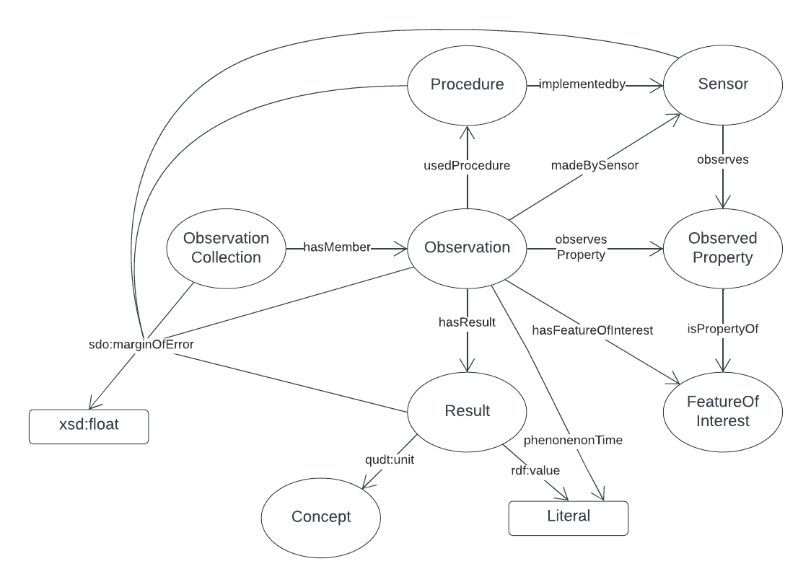

= GSQ Geochemistry Data Exchange Model - Specification
:Title: OGC GeoSPARQL - A Geographic Query Language for RDF Data
:titletext: {title}
:doctype: book
:encoding: utf-8
:lang: en
:table-stripes: odd
:toc: left
:toclevels: 2
:chapter-label:
:sectnums:
:sectnumlevels: 4
:sectanchors:
:figure-id: 0
:table-id: 0
:req-id: 0
:rec-id: 0
:per-id: 0
:xrefstyle: short
:source-highlighter: rouge

[#overview]
.An informal overview diagram of the data model in this Specification

include::01-abstract.adoc[]

include::02-preamble.adoc[]

include::03-intro.adoc[]

include::04-model.adoc[]

include::05-vocabs.adoc[]

include::06-validators.adoc[]

include::07-templates.adoc[]

include::08-references.adoc[]
