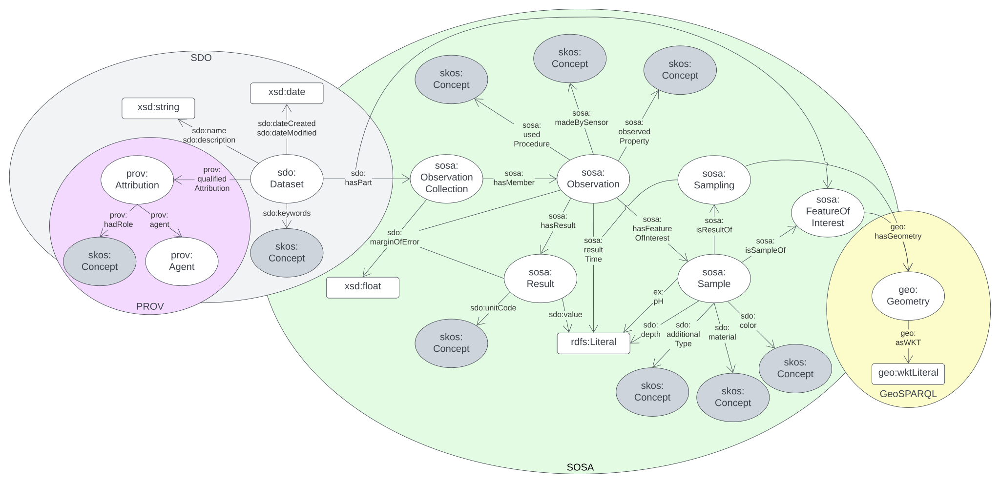

= Geochemistry Data Model - Specification
:Title: Geochemistry Data Model - Specification
:titletext: {title}
:doctype: book
:encoding: utf-8
:lang: en
:table-stripes: even
:toc: left
:toclevels: 3
:chapter-label:
:sectnums:
:sectnumlevels: 4
:sectanchors:
:figure-id: 0
:table-id: 0
:req-id: 0
:rec-id: 0
:per-id: 0
:xrefstyle: short
:source-highlighter: rouge

[#overview]
.An overview diagram whole Data Model

== Metadata

[frame=none, grid=none, cols="1,5"]
|===
|*<<IRI, IRI>>* | https://linked.data.gov.au/def/geochem
|*https://schema.org/name[Name]* | Geochemistry Data Model - Specification
|*https://www.w3.org/TR/skos-reference/#definition[Definition]* | This document is the normative specification of the Geochemistry Data Model that is being developed as a potential Australian national geochemistry data excahnge standard.
|*https://schema.org/dateCreated[Created Date]* | 2023-09-15
|*https://schema.org/dateModified[Modified Date]* | 2024-01-16
|*https://schema.org/dateIssued[Issued Date]* | _Not issued yet_
|*https://schema.org/version[Version]* | 1.0
|*https://www.w3.org/TR/2012/REC-owl2-syntax-20121211/#Ontology_IRI_and_Version_IRI[Version IRI]* | https://linked.data.gov.au/def/geochem/1.0[geochem:1.0]
|https://www.w3.org/TR/skos-reference/#historyNote[*History Note*]|
*1.0* - 2023 Sep - 2024 Jan - Initial version created for GSQ
|*https://schema.org/creator[Creator]* |  https://kurrawong.ai[KurrawongAI] for the https://linked.data.gov.au/org/gsq[Geological Survey of Queensland]
|*https://schema.org/owner[Owner]* | https://linked.data.gov.au/org/gsq[Geological Survey of Queensland]
|*https://schema.org/publisher[Publisher]* | https://linked.data.gov.au/org/gsq[Geological Survey of Queensland]
|*https://schema.org/license[License]* | https://creativecommons.org/licenses/by/4.0/[Creative Commons Attribution 4.0 International (CC BY 4.0)]
|*https://www.w3.org/TR/vocab-dcat/#Property:resource_contact_point[Contacts]* |
*Geoscience Information Team* +
https://linked.data.gov.au/org/gsq[Geological Survey of Queensland] +
Department of Resources, Brisbane, QLD, Australia +
geological_info@resources.qld.gov.au

For technical modelling matters:

*Nicholas Car* +
https://kurrawong.ai[KurrawongAI] +
nick@kurrawong.ai

Issue tracking is managed online at https://github.com/Kurrawong/gsq-geochem/issues
|*https://schema.org/codeRepository[Code Repository]* | https://github.com/Kurrawong/gsq-geochem
|===

include::01-abstract.adoc[]

include::02-preamble.adoc[]

include::03-intro.adoc[]

include::04-patterns.adoc[]

include::05-model.adoc[]

include::06-vocabs.adoc[]

include::07-profiles.adoc[]

include::08-validation.adoc[]

include::09-data-formats.adoc[]

include::99-references.adoc[]
