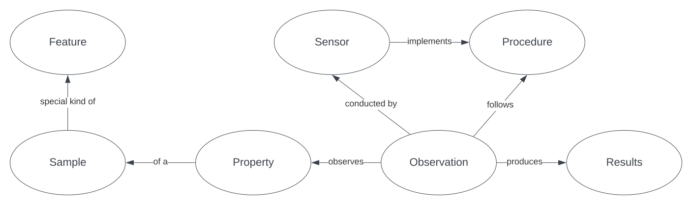

== Introduction

This section introduces the general domain of information modelling that we use for geochemistry observations and then describes the particular representation mechanism used. Following sections then detail the model itself and provide reference material and validators.

=== Conceptual

==== Observations & Measurements

Geochemistry data - results of chemical and other analyses of geological samples - is a type of _observations_ data: observations of the natural world that result in measured properties. The general-purpose standard we use for modelling _observations_ data is the ISO's _Observations & Measurements_ (O&M) <<ISO19156>>.

O&M separates aspects of an _observations_ scenario into distinct information elements in order to ditinguish between the thing observed, the act of observing and outputs from the observing act. An informal, high-level, view of the conceptual elements of O&M is given in <<om-high-level>>.

[#om-high-level]
.An informal, high-level, view of the conceptual elements of _Observations & Measurements_ (O&M) <<ISO19156>>.

In <<om-high-level>>, an _Observation_, an event, _observes_ a _Property_ of a _Sample_ (could be a chunk of rock, or a soil sample) which is a sample of a _Feature_ (could be a rock unit) and _produces_ a _Result_ according to a _Procedure_ which is implemented by/in a Sensor. Detailed representations of the sub-elements of _Observation_, _Feature_, _Property_ and so on are all specified by the use of other models, such as the _Quantities Units Dimensions & Types_ model for _Result_ elements which include the actual value measured, the measurement units and so on.

=== Logical

==== SOSA

There are many implementations of the O&M conceptual model and the one used here is the _SOSA (Sensor, Observation, Sample, and Actuator)_ ontology <<SSN>> which realises the elements and relations of O&M as <<OWL2, OWL>> _Classes_ and _Properties_. Using an OWL logical model allows for the exchange of data in the <<RDF, RDF>> format (a physical model).

SOSA's _Classes_ and _Properties_ for the elements in <<om-high-level>> are given in <<sosa-overview>>.

[#sosa-overview]
.An informal overview diagram of the SOSA data model using ellipses for OWL classes and named arrows for OWL properties
image::../img/overview.svg[SOSA Model Overview,align="center"]

In <<sosa-overview>>, you can see a class for each of the elements in <<om-high-level>> as well as additional classes for collections of Observation elements and the units of a Result.

==== Background Models

As mentioned in the section above, detailed modelling of aspects of O&M's main elements are undertaken by other models, therefore, to completely model geochemistry data, we need more than just SOSA: we need a profile of SOSA and several other models, the union of which forms our overall model.

These other models we call _background models_ to distinguish them from SOSA which is then our _foreground model_.

Our set of background models, which are all <<OWL2, OWL>> models are:

GeoSPARQL <<GSP>>:: for relating spatial objects to one another and to representations of their geometries

QUDT <<QUDT>>:: for describing the values, units and references of results

SKOS <<SKOS>>:: for describing the structure of reference vocabularies and the relations between concepts within them

schema.org <<SDO>>:: for many general-purpose classes and properties

All the background models we use have obvious connection points to our SOSA foreground model. For example, GeoSPARQL contains _Feature_ & _Geometry_ classes and the _Feature_ class is a superset of SOSA's _Feature of Interest_ class, thus any SOSA _Feature of Interest_ is a GeosPARQL _Feature_ and may have a GeoSPARQL _Geometry_ associated with it. <<sosa-geosparql>> shows this relationship.

[#sosa-geosparql]
.An informal diagram showing how SOSA and GeoSPARQL are related to one another based on the _Feature_ & _Feature of Interest_ class relationship
image::../img/sosa-geosparql.svg[SOSA/GeoSPARQL,align="center"]

The formal modelling of the following section relates SOSA foreground model classes to relevant background model classes using <<OWL2, OWL>> relations.

=== Physical

==== RDF

As mentioned at the start of the section above, the physical data implementation of the SOSA ontology logical model is the Resource Description Framework [<<RDF, RDF>>].

RDF data can be serialised in multiple formats. The format we use here for definitions and examples is Turtle <<TURTLE>>. <<turtle-eg>> below shows a dummy geochemistry _Observation_ represented according to SOSA and serialised in RDF's Turtle format.

[#turtle-eg]
.Example SOSA data in RDF's Turtle format, for a single geochemistry `Observation` according to the SOSA Ontology <<SSN>>
[source,turtle]
----
PREFIX ex: <http://example.com/>
PREFIX op: <https://linked.data.gov.au/def/observable-properties/>
PREFIX qudt: <http://qudt.org/schema/qudt/>
PREFIX sdo: <https://schema.org/>
PREFIX skos: <http://www.w3.org/2004/02/skos/core#>
PREFIX xsd: <http://www.w3.org/2001/XMLSchema#>

ex:obs-1
    a sosa:Observation ;
    sosa:usedProcedure ex:procedure-a ;
    sosa:observedProperty op:amount-of-gold ;
    sosa:hasFeatureOfInterest ex:sample-c ;
    sosa:hadPhenomenonTime "2023-05-11"^^xsd:date ;
    sosa:hasResult
        ex:result-d ,
        ex:result-e ;
.

ex:procedure-a
    a skos:Concept ;
    skos:prefLabel "Procedure A" ;
    skos:definition "Procedure A is a method for assessing the amount of gold in a soli sample. " ;
.

ex:sample-c
    a sosa:Sample ;
    sdo:name "Sample C" ;
    sdo:additionalType ex:soil-sample ;
    sdo:description "A soil sample from Sandy Creek" ;
    sdo:location "Zillmere Rock Store: Zone 4, Shelf N, Box 3" ;
    sosa:isSampleOf ex:sandy-creek ;
.

ex:result-d
    qudt:numericValue 0.027  ;
    qudt:units <https://qudt.org/vocab/unit/PPM> ;
.

ex:result-e
    qudt:numericValue 27.0 ;
    qudt:units <https://qudt.org/vocab/unit/PPB> ;
.

ex:sandy-creek
    a sosa:FeatureOfInterest ;
.
----

In the example data above in <<turtle-eg>, the `Observation` object, `ex:obs-1`, has a number of properties indicated, such as `sosa:hasFeatureOfInterest` which indicates the thing the observation is of, here the `Sample` `ex:sample-c`. The object `ex:sample-c` in turn has properties such as `sosa:isSampleOf` indicating that it's a sample of `ex:sandy-creek` which, although no properties are given, we understand to be a `Feature` by virtue of it being referenced by a property that indicates `Feature` instances.

=== Profiles

Not all classes and properties must be implemented to make valid data according to this model. For example, the `Result` of an `Observation` may have a `margin of error` indicated, but it need not and a dataset may indicate a `Feature Of Interest` with geospatial location but need not.

To know if data is valid according to this model, you need to apply a validator, given in the section <<Validators>> to it. That section describes what the validators are, what they look for and tools that you can use to apply them.
