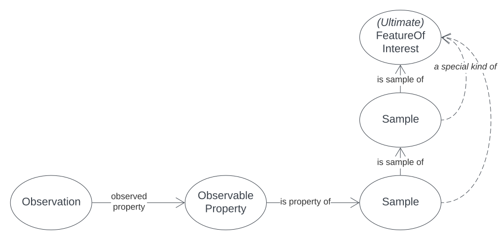
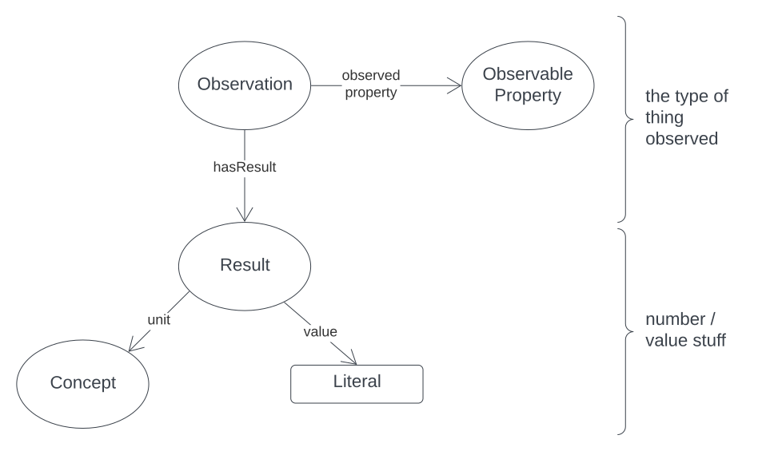

== Model

This section describes each of the Classes and Properties shown in the models used - both the SOSA foreground model <<SSN>> and the relevant parts of the background models (<<DCAT>>, <<GSP>>, <<PROV>>, <<SDO>>). All the Classes and Properties described are shown in <<whol-model>>.

[#whole-model]
.An OWL diagram with additional class groupings of the foreground model and background model components used for geochemistry data modelling
image::../img/whole-model.svg[SOSA Model Overview,align="center",link="../img/whole-model.svg"]

=== Patterns

Many of the parts of this complete foreground and background logical model implementation of the conceptual model are fairly obvious, for example, the classes and properties modelling that an _observation observes_ a _property_ of a _sample_, however there are patterns that need a bit more explaining, so here some of them are explained.

==== Open World Assumption

This is a general principle of the kind of modelling that this system uses and it is that if something isn't recorded in data, it is unknown and _NOT_ known to be false. For example, if a person's birth is recorded and not their death, we must interpret this as not that they are still allive but that we just don't know a death date, or even if they are dead. This is important in all kinds of models.

In geochemistry, we might not see a _margin of error_ in data. This doesn't mean there wasn't one, only that we don't know what it was, or that it just wasn't recorded.

A corollary to this is that while this specification has a minimum data model - the things you _must_ record for geochemistry observations - there really is no lmit on what you _may_ record. You might supply lots of metadata for a collection of geochemistry, beyond just who created the data, when and so on. You might also supply lots of information about the _Sensor_ used, not just its ID.

==== Sample & Feature Of Interest

The SOSA model considers the thing for which properties are being observed to be a _Feature Of Interest_. This is really anything that is the target of observation's attempts to characterise, say, the amount of gold in it. So it's a relative thing, not an absolute thing: my FoI may not be an FoI as you see it.

The things we most commonly observe properties for are samples which we would represent with the SOSA `Sample` class. A `Sample` that underwent observation of its properties would automatically also be a `Feature Of Interest`.

_Sample_ is defined in SOSA to be something which "subsets or extracts from" something else in order for that something else to be characterised. So this is our standard understanding of what a sample is, whether it's a rock sample, a statistical sample or other.

SOSA also models a `Sample` as a special kind of `Feature Of Interest` since anything whose properties are observed is an FoI but not all FoIs are samples - you could directly observe properties of an entire rock unit using a remote sensing technique.

Finally, we may observe the properties of a _Sample_ that is taken from another _Sample_ in a long chain of samples all the way through to the rock unit that is the final target of characterisation. Perhaps we are performing geochem analysis on rock chips taken from a core section, taken from a core taken from a rock unit. In that scenario, the first sample is a _sample of_ the second and so on, all the way to the _Ultimate Feature of Interest_ - the rock unit.

[#sample-foi]
.The relations between Observations, Samples & Features of Interest


==== Spatiality

SOSA, and OWL modelling generally, allows for the assignment of spatiality - location - to many things, so we need to ensure what's sensible to do.

The location of a sample's origin, or the ultimate feature of interest's location is important to know: where are these geochemistry results for? However, the location of the sample now, may or may not be important to know - perhaps it's in Shed A, Shelf 5, Box 3c.

In a similar way, we don't necessarily need to know where the observation took place - in some geochem lab somewhere.

Due to the _Sample_ / _Feature Of Interest_ pattern above, we will infer that any spatiality given for a _Sample_ is really the spatiality of the _(ultimate) Feature Of Interest_, rather than the sample itself.

If you specifically want to indicate the spatiality of a _Sample_ _now_, you can use the `hasCurrentLocation` dedicated property for that like this:

[source,turtle]
----
ex:sample-a
    gas:hasCurrentLocation [
        sdo:description "GSQ Shed A, Shelf 5, Box 3c"
    ] ;
.
----

If you indicate spatiality ambiguously like this:

```
SampleID    Location        ...
--------    --------        ----
Sample A    152.23, -35.45  ...
```

This model will interpret the coordinates `152.23, -35.45` as being the `samplingLocation` of the Sample A, which is clearly (part of) the location of the (ultimate) Feature of Interest that Sample A is a sample of.

==== Result

Results modelling here is intended to represent only the value of the result and any other information needed to understand the value itself, not the overall context. This means, usually, a result _value_ and a _unit_ (of measure). Some results don't need a _unit_, for example a classification into categories.

Information about what the result is for - what property of the thing observed - is recorded in alongside the _Observation_, not the result. This means you need an Observation per "type" of measured value, e.g. _amount of gold_, _amount of copper_ etc.

So when we measure gold, copper, mercury in a soil sample, we need 3 observations and at least 3 results - one per observation.

We _could_ have more than one _Result_ form an _Observation_, e.g. a parts per million and a % value, but this contains redundant information since we can calculate one from the other.

[#results]
.The concerns of Observations / Observed properties & results


==== Observation Collections

Observations are usually taken in batches or runs where many observations are made together. Perhaps observations are conducted in separate evens however the data from them is presented in a collection.

To represent these groupings, we use an `Observation Collection` object. Such object may have any of the properties of an individual `Observation` where the property pertains to all members of the collection. For example, if an `Observation Collection` contains that 100 `Observation` instances and the collection indicates the property `used procedure` indicating a value of `X`, then it is understood that all of the `Observation` instances used the procedure `X`.

Additional metadata may be associated with an `Observation Collection` that is not directly associated with any single Observation but which nevertheless is valid at the collection level, for example a Bach ID of "7" - true for the batch / Observation Collection and not specifically for any single Observation.

Observation Collections can be further grouped into datasets: perhaps a company has run 5 batches of observations - 5 Observation Collections - for a prospective mining region and bundles them all up to be sent to GSQ. In that case, it's sensible to have one dataset with basic metadata about who provided this data, when etc. and then the 5 Observations Collections within that grouping together all the Observations in each batch.

==== Attribution

A common issue for data modelling where data generation is distributed across organisations is to indicate what roles _Agents_ - Organisations & People - played with respect to data. For example, for geochemistry data, there may be an obvious

=== Classes

Here be classes

[[sosa:Observation]]
==== Observation

[cols="2,6"]
|===
| Property | Value

| IRI | `sosa:Observation`
| Preferred Label | Observation
| Definition | Act of carrying out an (Observation) Procedure to estimate or calculate a value of a property of a FeatureOfInterest.
| Is Defined By | <<SSN>>
| Expected Properties | <<sosa:usedProcedure>>, <<sosa:madeBySensor>>, <<sosa:observedProperty>>, <<sosa:hasFeatureOfInterest>>, <<sosa:phenomenonTime>>, <<sosa:hasResult>>, <<sdo:marginOfError>>
| Example
a| [source,turtle]
----
PREFIX ex: <http://example.com/>
PREFIX op: <https://linked.data.gov.au/def/observable-properties/>
PREFIX xsd: <http://www.w3.org/2001/XMLSchema#>

ex:obs-1
    a sosa:Observation ;
    sosa:usedProcedure ex:procedure-a ;
    sosa:observedProperty op:amount-of-gold ;
    sosa:hasFeatureOfInterest ex:sample-c ;
    sosa:hadPhenomenonTime "2023-05-11"^^xsd:date ;
    sosa:hasResult
        ex:result-d ,
        ex:result-e ;
.
----
|===

[[soa:Result]]
==== Result

[cols="2,6"]
|===
| Property | Value

| IRI | `sosa:Result`
| Preferred Label | Result
| Definition | The Result of an Observation.
| Is Defined By | <<SSN>>
| Expected Properties | <<rdf:value, value>>, <<qudt:unit, unit>>, <<sdo:marginOfError, margin of error>>
| Example
a| [source,turtle]
----
PREFIX ex: <http://example.com/>
PREFIX qudt: <http://qudt.org/schema/qudt/>

ex:result-d
    qudt:numericValue 0.027  ;
    qudt:units <https://qudt.org/vocab/unit/PPM> ;
.
----
|===

[[soa:Sample]]
==== Sample

[cols="2,6"]
|===
| Property | Value

| IRI | `sosa:Sample`
| Preferred Label | Sample
| Definition | Samples are typically subsets or extracts from the feature of interest of an observation.
| Is Defined By | <<SSN>>
| Expected Properties |
| Scope Note | Use this class to characterise the thing that geochemistry observations attempted to characterise the properties of
| Example
a| [source,turtle]
----
PREFIX ex: <http://example.com/>
PREFIX qudt: <http://qudt.org/schema/qudt/>
PREFIX rdf: <http://www.w3.org/1999/02/22-rdf-syntax-ns#>

ex:result-d
    rdf:value 0.027  ;
    qudt:units <https://qudt.org/vocab/unit/PPM> ;
.
----
|===

=== Properties


[[rdf:value]]
==== value

[[qudt:unit]]
==== unit

[[gas:currentLocation]]
==== current location


[[sosa:usedProcedure]]
==== used procedure

[[sosa:madeBySensor]]
==== made by sensor

[[sosa:observedProperty]]
==== observed property

[[sosa:hasFeatureOfInterest]]
==== has feature of interest

[[sosa:phenomenonTime]]
==== phenomenon time

[[sosa:hasResult]]
==== has result

[[sdo:marginOfError]]
==== margin of error